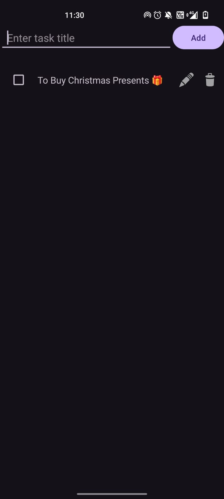
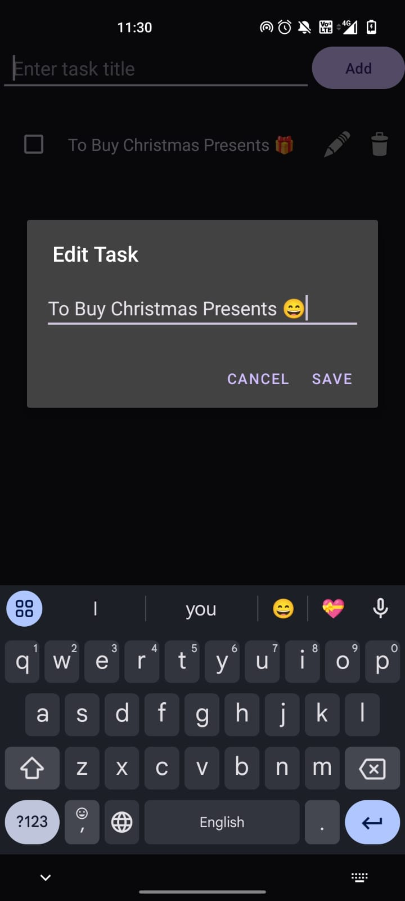

# 📋 **To-Do List App**  
### A Simple and Organized To-Do List Application  

---

## 📝 **Overview**  
**To-Do List App** is a fully functional and user-friendly application designed to help users manage and track their tasks efficiently. This app was developed as part of my **Android Development Internship** at **Prodigy InfoTech**.  

---

## ✨ **Features**  
- ✅ Easy-to-use interface for adding, editing, and deleting tasks.  
- ✅ Option to mark tasks as completed or pending.  
- ✅ Organize tasks with priority levels (High, Medium, Low).  
- ✅ Search and filter tasks by completion status or priority.  
- ✅ Option to sort tasks by due date or priority.  

---

## 📸 **Screenshots**  
<p align="center">
    
  
</p>  

---

## 🛠️ **Technologies Used**  
- **IDE**: Android Studio  
- **Language**: Java  
- **UI Design**: XML  

---

## 🚀 **How to Use**  
1. Download and install the app on your Android device.  
2. Open **To-Do List App**.  
3. Tap the **Add Task** button to create new tasks.  
4. Mark tasks as **Completed** or **Pending** by tapping the task.  
5. Edit or delete tasks as needed.  
6. Sort and filter tasks based on priority or due date.  

---

## ⚙️ **Setup Instructions**  
To clone and run this project on your local machine:  

1. Install **Android Studio**.  
2. Clone this repository:  
   ```bash  
   https://github.com/thirusudar03092003/PRODIGY_AD_02.git
